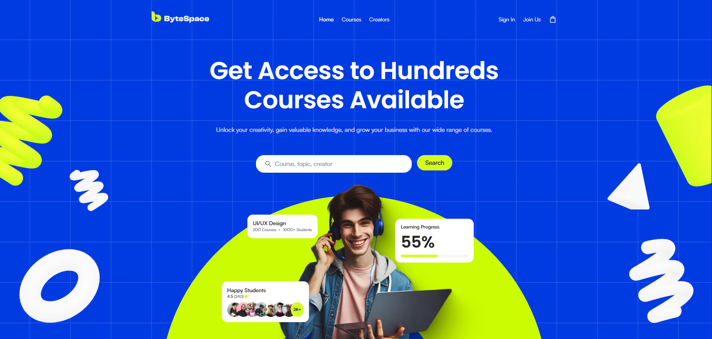
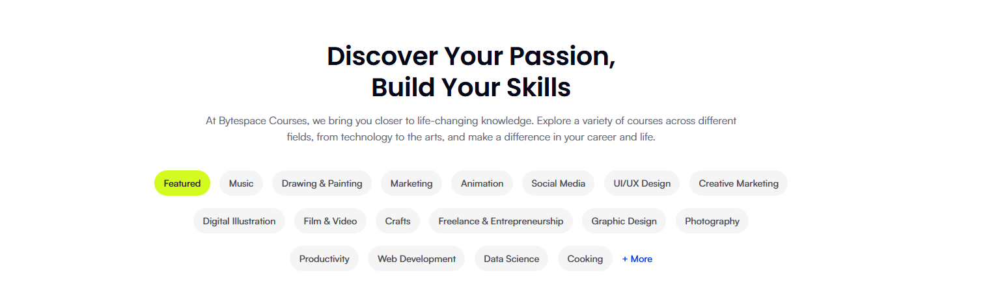
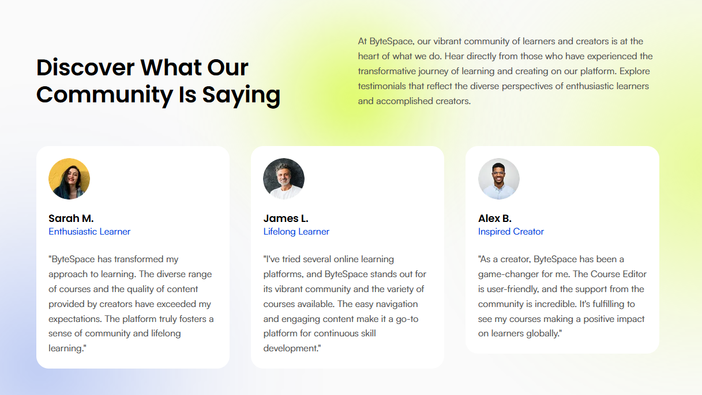
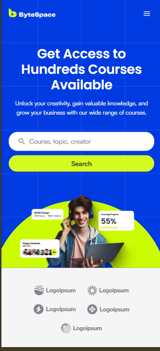
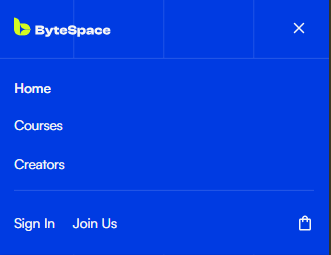
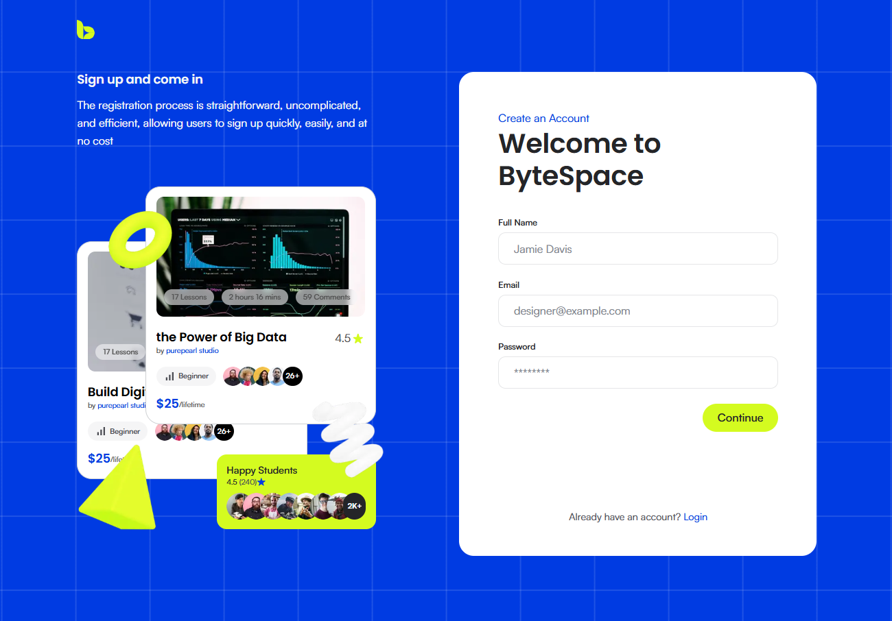
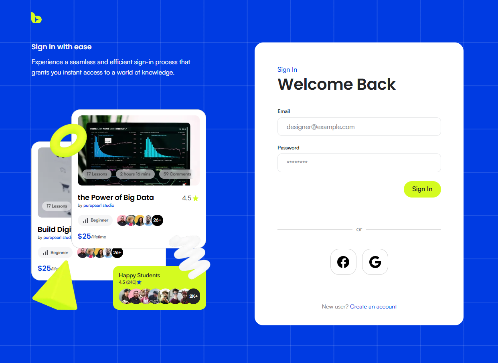

<div align="center">


# ByteSpace

**A modern online learning platform landing page, built pixel by pixel from Figma**

[](https://nextjs.org)
[](https://www.typescriptlang.org)
[](https://tailwindcss.com)
[](https://bytespace-web-coral.vercel.app)
[](#-lighthouse-results)

[**Live Demo**](https://bytespace-web-coral.vercel.app) &nbsp;•&nbsp; [**Screenshots**](#-screenshots) &nbsp;•&nbsp; [**Getting Started**](#-getting-started)

<sub>Built for the Doin Tech Limited hiring assessment · Jr. Software Engineer (Frontend)</sub>

</div>

<br />



## ✨ Highlights

- 🎯 **Faithful to the design:** every section of the Figma Home frame, matched at 1440px
- 🎨 **Token based design system:** all colors and text styles from the Figma Style Guide live in one place as Tailwind theme tokens
- 📱 **Fully responsive:** thoughtful tablet and mobile layouts, including a keyboard accessible mobile menu
- ♿ **Accessibility 100** on Lighthouse, on both desktop and mobile
- ⚡ **Fast:** Performance 99 on desktop and 95 on mobile, with zero layout shift
- 🔐 **Bonus pages:** Login and Signup with client side validation and clear focus, error and disabled states
- 🧩 **Clean architecture:** small reusable components, strict TypeScript, and all content in typed data arrays

## 📸 Screenshots

### Landing page






### Mobile

<table>
  <tr>
    <td align="center"><br /><sub>Home</sub></td>
    <td align="center"><br /><sub>Navigation menu</sub></td>
  </tr>
</table>

### Registration and Login

<table>
  <tr>
    <td align="center"><br /><sub>Create an account</sub></td>
    <td align="center"><br /><sub>Sign in</sub></td>
  </tr>
</table>

## 📊 Lighthouse Results

Measured on the production build in an incognito window.

| Device     | Performance | Accessibility | Best Practices |   SEO   |
| :--------- | :---------: | :-----------: | :------------: | :-----: |
| 🖥️ Desktop |   **99**    |    **100**    |    **100**     | **100** |
| 📱 Mobile  |   **95**    |    **100**    |     **96**     | **100** |

> **Note on mobile Best Practices:** Lighthouse reports a "low resolution image" for the hero photo. On small screens the hero illustration is scaled down with a CSS transform, and Lighthouse measures the image at its unscaled size. The served image is sharp at its real rendered size, and a larger file would only slow down the Largest Contentful Paint, so this is kept on purpose.

## 🛠️ Tech Stack

| Area      | Choice                                                                       |
| :-------- | :--------------------------------------------------------------------------- |
| Framework | Next.js 16 (App Router, Turbopack)                                           |
| Language  | TypeScript in strict mode, no `any`                                          |
| Styling   | Tailwind CSS v4 with theme tokens in `app/globals.css`                       |
| Fonts     | `next/font` with Poppins (Google Fonts) and Satoshi (Fontshare, self hosted) |
| Images    | `next/image` with responsive `sizes`                                         |
| Quality   | ESLint with the Next.js configuration                                        |

No UI library was used. Every component is written from scratch.

## 🚀 Getting Started

**Requirements:** Node.js 20.9 or newer (developed on Node.js 24.12.0)

```bash
git clone https://github.com/ShArafat58/bytespace-web.git
cd bytespace-web
npm install
npm run dev
```

Open [http://localhost:3000](http://localhost:3000).

| Command         | Description                  |
| :-------------- | :--------------------------- |
| `npm run dev`   | Start the development server |
| `npm run build` | Create a production build    |
| `npm start`     | Serve the production build   |
| `npm run lint`  | Run ESLint                   |

## 🗂️ Scope

| Page                    | Route     | Status |
| :---------------------- | :-------- | :----: |
| Landing page (required) | `/`       |   ✅   |
| Signup (bonus)          | `/signup` |   ✅   |
| Login (bonus)           | `/login`  |   ✅   |

Other pages in the Figma file (Search, Course Details, Course Lessons, Course Reviews, Creator Profile, 404) were outside the assessment scope.

## 📁 Project Structure

<details>
<summary><b>Show folder structure</b></summary>
<br />

```
app/
  fonts/               Satoshi woff2 files (Regular, Medium, Bold)
  globals.css          Design tokens (colors, typography, utilities)
  layout.tsx           Root layout, fonts and metadata
  page.tsx             Landing page composed from section components
  login/page.tsx       Login route
  signup/page.tsx      Signup route
  icon.svg             Brand favicon
components/
  auth/                Auth layout, illustration and the two forms
  icons/               Inline SVG icon components
  sections/            One file per landing page section
    career/            Growth row, creator row and revenue card
    discover/          Category tag list
    footer/            Newsletter form
    header/            Mobile menu
    hero/              Search bar, visual and floating card
  ui/                  Reusable building blocks (Button, Tag, CourseCard,
                       AvatarGroup, TextField, SectionHeading, and more)
lib/
  data/                Typed content arrays (navigation, courses, categories,
                       testimonials, footer links, and more)
  hooks/               useValidatedForm
  fonts.ts             Font configuration
  utils.ts             Class name helper
  validation.ts        Form validators
public/images/         Photos, avatars, partner logos and decorative shapes
docs/screenshots/      Images used in this README
```

</details>

All repeated content (courses, categories, learning paths, testimonials, footer links) lives in typed arrays under `lib/data` and is rendered with `map`, so no markup is copy pasted.

## 🧠 Implementation Notes

**Design system.** The Figma Style Guide was translated into Tailwind theme tokens: three color scales (Neutral, Primary, Secondary) from 50 to 950, plus the Heading, Body and Label text styles with their exact sizes and line heights. Components use only these tokens, never raw hex values or font sizes.

**Landing page.** Header, Hero, Partner Logos, Discover Courses, Learning Paths, Career Growth and Creator rows, Creator Call to Action, Testimonials and Footer.

**Auth pages.** Both forms share a small `useValidatedForm` hook. Fields are validated on blur and on submit, and errors are announced to screen readers through `aria-invalid` and `aria-describedby`. The Sign in and Join Us links in the header lead to these routes.

**Responsive behavior.** The Figma design is desktop only, so the tablet and mobile layouts are my own decisions:

- Below 1024px the header navigation collapses into a mobile menu that closes with Escape.
- Course cards go from 3 to 2 to 1 column, learning paths from 6 to 3 to 2, testimonials from 3 to 2 to 1.
- The hero and career illustrations are scaled as one unit, so the floating cards keep their position relative to the photo.
- Decorative shapes are hidden below 1280px, where they would overlap the content.
- Two column rows stack vertically, with the text placed before the visual.

**Accessibility.** Semantic landmarks, a correct heading order, descriptive alt text, real buttons and links, and visible focus styles across the whole page.

## 📝 Assumptions and Design Decisions

Where the design left something open, I made a decision and documented it:

1. **Secondary text color:** body text using Neutral 400 on white was changed to Neutral 500 to meet the WCAG AA contrast ratio (4.5:1). Placeholders and icons keep Neutral 400.
2. **Error color:** the style guide has no error color, so `#dc2626` was added for form validation only.
3. **Category tags** change their active state when clicked, but do not filter the course list, since no filtering behavior was specified.
4. **The "Creators" nav link** scrolls to the Creator Call to Action section.
5. **Newsletter button** keeps the "Search" label from the Figma file, although "Subscribe" may have been intended.
6. **Footer copyright** uses the `©` symbol where the design shows `@`.
7. **Footer column heading:** one link column had no heading in the design, so "Categories" was used.

## ⚠️ Known Limitations

- **No backend or real authentication.** The Login and Signup forms validate input on the client only and show a demo confirmation on submit. Social login buttons show a message that they are not available in this demo.
- **The hero search and newsletter form** are UI only and do not send data anywhere.
- **Only the pages listed in Scope** are implemented. Links to pages outside the scope lead to sections on the landing page.

## 🌿 Git Workflow

| Branch                 | Contents                                                                                     |
| :--------------------- | :------------------------------------------------------------------------------------------- |
| `main`                 | Production branch, deployed automatically to Vercel                                          |
| `feature/landing-page` | The landing page, one commit per section                                                     |
| `feature/auth-pages`   | Built on top of `feature/landing-page`: Login and Signup pages, responsive work and QA fixes |
| `docs/update-readme`   | Live demo link and documentation updates                                                     |

`feature/auth-pages` carries the full history of both feature branches and was merged into `main` through [Pull Request #1](https://github.com/ShArafat58/bytespace-web/pull/1). Documentation updates were merged through Pull Request #2. Commits are small and follow a conventional style (`feat:`, `fix:`, `perf:`, `docs:`).

## 👤 Author

<div align="center">

**Shahriar Hossain Arafat**

[](https://github.com/ShArafat58)

</div>
